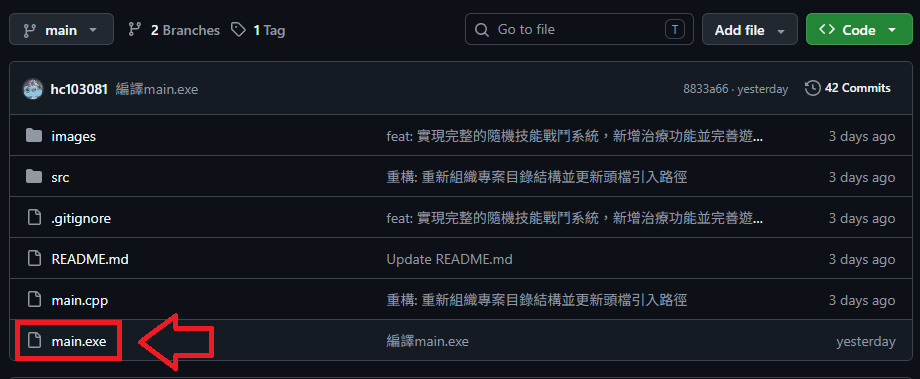
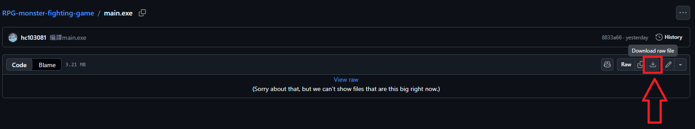
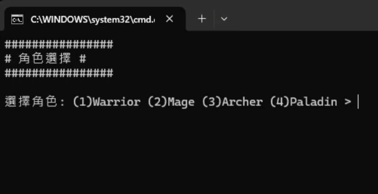
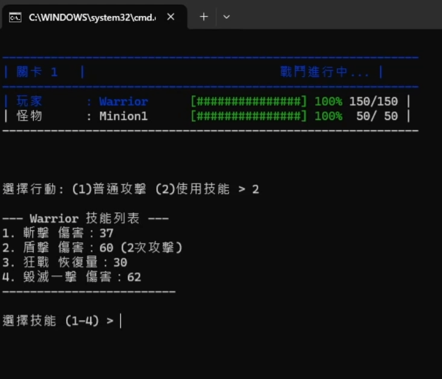
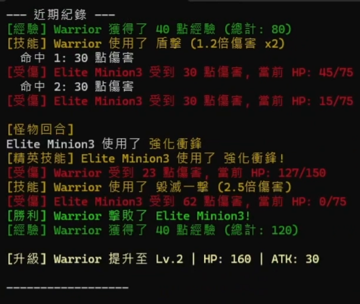
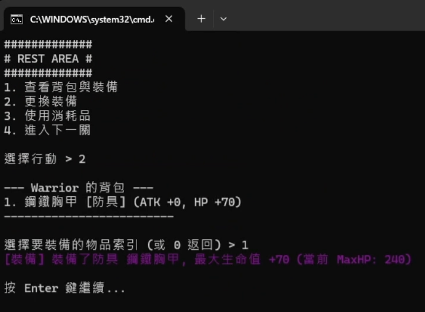
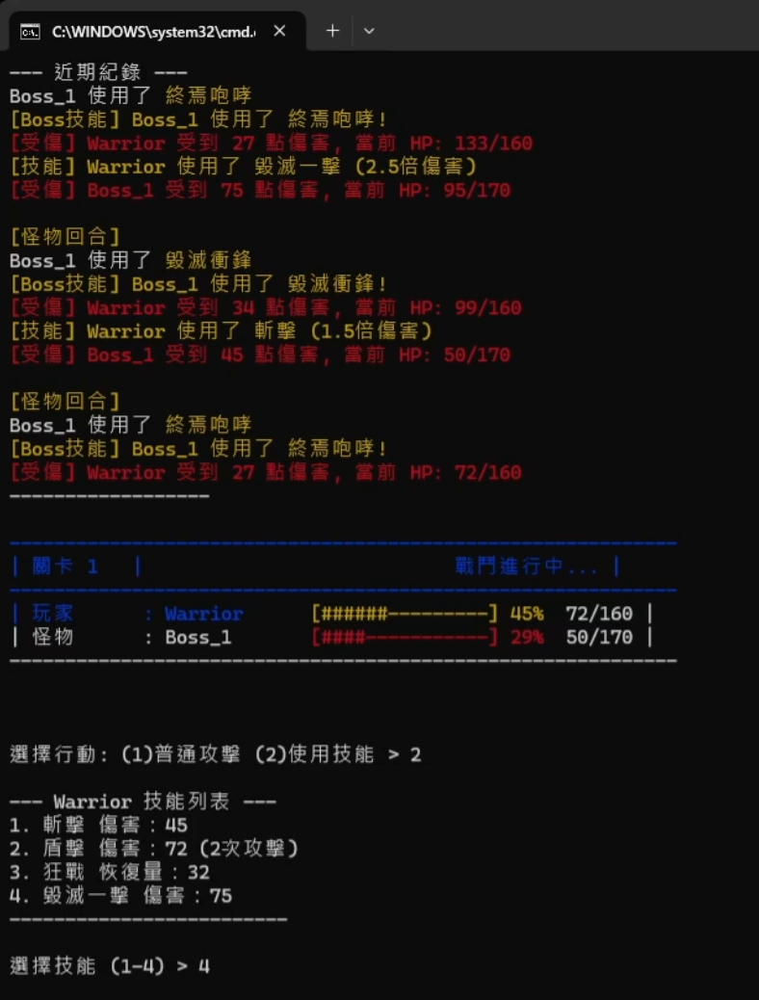
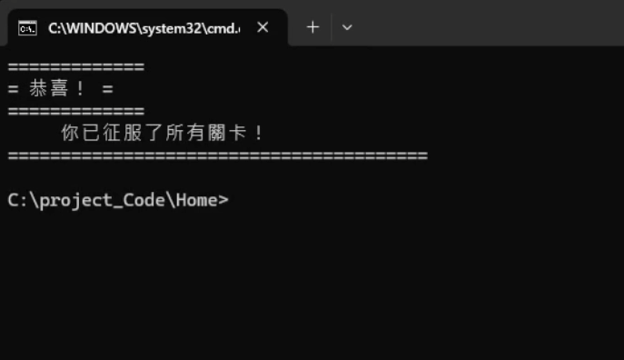
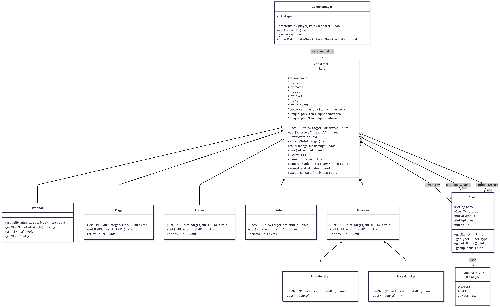

# RPG角色打怪遊戲

## 小組資料 & 分工

***

- **系級班級: 資工1B**
- **組別: 23**
- **組長: 程家豪**
- **組員: 黃奕嘉、黎國英**
- **專題實作者: 程家豪、黃奕嘉**
- **潛水實作者: 黎國英**

## 簡報檔:

[RPG角色打怪遊戲.pdf](https://raw.githubusercontent.com/hc1053204-max/RPG-monster-fighting-game/refs/heads/main/RPG%E8%A7%92%E8%89%B2%E6%89%93%E6%80%AA%E9%81%8A%E6%88%B2.pdf)  

## 遊戲介紹

***

這是一款充滿挑戰的**文字冒險 RPG 戰鬥遊戲**。玩家將扮演一名勇敢的英雄，踏上征服危險地城的旅程。在遊戲中，你必須面對不斷強化的怪物群與毀滅性的 Boss。透過選擇合適的職業、在戰鬥中積累經驗、以及在休息區策略性地管理裝備與消耗品，你將在生死邊緣徘徊，目標是突破所有關卡，成為最終的勝利者。

## 遊戲規則

***

### 1. 核心目標

玩家選擇一名英雄角色，挑戰總共 **5 個關卡**。必須依序擊敗每一關的所有小怪與 Boss，最終擊敗第 5 關的 Boss 即可獲得遊戲勝利。

### 2. 角色選擇

遊戲開始時可選擇以下四種職業之一：

- **戰士 (Warrior)**：高生命值與生存能力。
- **法師 (Mage)**：強力遠端攻擊。
- **弓箭手 (Archer)**：靈活且高效的輸出。
- **聖騎士 (Paladin)**：均衡的攻防與恢復能力。

### 3. 關卡機制

- **小怪挑戰**：每關會出現隨機數量的小怪，屬性隨關卡等級線性成長。
- **精英怪 (Elite Monster)**：小怪中有 20% 的機率出現精英怪，其生命值 (1.5x) 與攻擊力 (1.2x) 遠高於普通小怪。
- **Boss 戰**：每關結尾必須擊敗一名強大的 Boss 才能晉級。
- **成長系統**：擊敗怪物可獲得經驗值 (XP) 以提升等級。

### 4. 遊戲流程

1. **初始化** → 選擇職業 → 進入第 1 關。
2. **戰鬥階段** → 消滅所有小怪 → 擊敗關卡 Boss。
3. **休息階段** → 管理裝備 → 使用藥水 → 恢復生命。
4. **晉級** → 進入下一關 (直到第 5 關)。
5. **結果判定** → 全關卡通關 (勝利) 或 HP 歸零 (失敗)。

### 5. 裝備與物品系統

擊敗 Boss 後將隨機掉落以下物品：

- **武器 (Weapon)**：提升攻擊力。
- **防具 (Armor)**：提升防禦/生命相關屬性。
- **消耗品 (Consumable)**：如恢復藥水，用於恢復生命值。

### 6. 休息區域 (Rest Area)

擊敗 Boss 後進入休息階段，玩家可進行以下操作：

- 查看背包與當前裝備。
- 更換武器或防具。
- 使用消耗品恢復生命。
- **自動恢復**：在進入下一關前，角色將自動恢復 50% 的最大生命值。

### 7. 勝敗判定

- **勝利**：成功完成第 5 關並擊敗最終 Boss。
- **失敗**：當主角的生命值 (HP) 降至 0 時，遊戲立即結束。

## 遊戲玩法

***

- **操作方式**：遊戲採用純文字選單介面，玩家透過輸入數字來做出選擇（例如：選擇職業、在休息區執行行動等）。
- **戰鬥機制**：
  - **回合制對決**：玩家與怪物輪流採取行動。
  - **技能運用**：玩家可選擇發動基礎攻擊，或使用該職業特有的強力技能來造成更高傷害或達到特殊效果。
  - **屬性成長**：擊敗敵人獲得經驗值並升級，提升角色的基礎生存與戰鬥能力。
- **資源管理**：
  - **裝備強化**：在休息區可隨時更換掉落的武器與防具，以強化攻擊力或生命值。
  - **生命恢復**：策略性地使用消耗品（如藥水）來恢復 HP，確保能挺過高難度的 Boss 戰。

### 遊戲執行 & 安裝方式

***

- **點進main.exe**

- **下載main.exe**

- **下載後開啟main.exe**

### 遊戲畫面截圖

***

- **詳細遊戲介紹請參照短片：** <https://youtu.be/5NbB_mn_ZVI>
- **角色選擇畫面**

  
- **角色選擇技能畫面**

  
- **使用技能畫面**

  
- **角色裝備畫面**

  
- **Boss畫面**

  
- **關卡結束畫面**

### UML圖

